# Diseño de Arquitectura y Modelado — Proyecto TRINA

| Atributo | Valor |
|---|---|
| Proyecto | TRINA (VitrinaLocal) — Directorio comercial georreferenciado |
| Documento | Componente 3 del Acta (Arquitectura y modelado) |
| Versión | 1.0 — Línea base definitiva |
| Fecha | 5 de octubre de 2026 |
| Épica / Sprint | E3 / Sprint 3 (semanas 4–5, 12–25 oct). Se redacta en anticipo durante el cierre del Sprint 2 |
| Base | `trina-requirements.md` v1.0 (49 RF, 11 RNF) |
| Documentos hermanos | `trina-requirements.md` · `trina-ui-design.md` |
| Estado | Listo para aprobación del Supervisor |

Los diagramas están escritos en Mermaid y se visualizan en GitHub, GitLab, VS Code (con extensión) y la mayoría de editores Markdown.

---

## 0. Cumplimiento del Componente 3 del Acta

| Exigencia del Acta | Dónde está |
|---|---|
| Arquitectura de la solución | §2 (contexto, contenedores, componentes, despliegue) |
| Estructura tecnológica: PostgreSQL, API REST, MinIO | §2, §4 (datos), §5 (API), §7.2 (MinIO) |
| Documento SRS | `trina-requirements.md` |
| UML de **casos de uso** | §3.1 |
| UML de **clases** | §3.2 |
| UML de **secuencia** | §3.4 (cinco secuencias) |
| UML de **arquitectura** | §2.2 y §2.4 |
| Revisión del SRS | Control de versiones y revisión cruzada (DoD del SRS §8.1) |

---

## 1. Contexto, restricciones y principios

### 1.1 Restricciones heredadas

| Restricción | Descripción |
|---|---|
| Calendario | Hito de ejecución el 9 nov; sustentación el 16 nov. El desarrollo ocurre en las semanas 6–7 |
| Equipo | 3 personas: backend (Daniela), frontend y UI (Juan David), BD, infraestructura y QA (David) |
| Stack | Spring Boot, PostgreSQL, MinIO, aplicación web responsiva, JWT |
| Pagos | Solo simulados; sin dinero real ni DIAN |
| Datos personales | Ley 1581 de 2012 y política de la UQ |
| Presupuesto | Recursos gratuitos o de bajo costo |

### 1.2 Principios de arquitectura
1. **Monolito modular.** Un solo despliegue del backend con módulos por funcionalidad; evita la complejidad de los microservicios.
2. **Puertos para lo que puede cambiar.** Pagos, almacenamiento y correo se acceden mediante interfaces (`PaymentGatewayPort`, `StoragePort`, `MailPort`), con una implementación por defecto simple.
3. **Simplicidad medible.** Se elige la solución más simple que cumpla el RNF (por ejemplo, Haversine en lugar de PostGIS para ~200 negocios).
4. **El servidor es la autoridad.** Precios, disponibilidad, estados, permisos y cupos se validan siempre en el backend.
5. **Contrato primero.** El contrato OpenAPI se acuerda antes de implementar, para que frontend y backend avancen en paralelo.

---

## 2. Vistas de arquitectura

### 2.1 Contexto del sistema

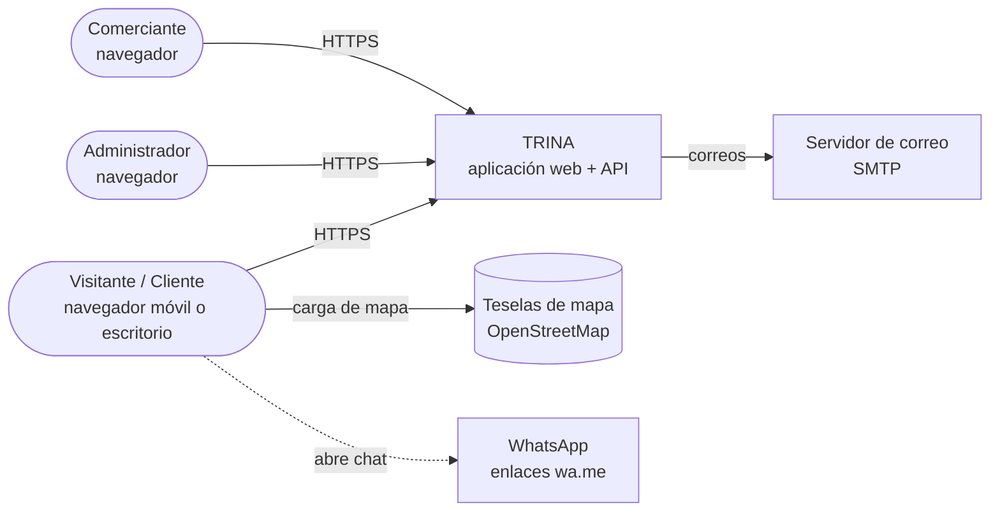

### 2.2 Contenedores

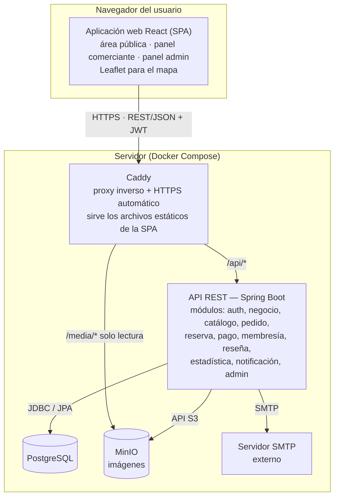

### 2.3 Componentes del backend

Estructura por funcionalidad (cada módulo con sus capas web, aplicación y dominio):

```text
co.edu.uniquindio.trina
├── auth          # registro, login, JWT, recuperación de clave, límite de intentos
├── usuario       # cuenta propia, privacidad (exportar/eliminar), gestión por admin
├── negocio       # negocio, horarios, imágenes, revisión, búsqueda y geolocalización
├── catalogo      # ítems y categorías internas
├── pedido        # pedidos, ítems, transiciones de estado, expiración
├── reserva       # reservas, capacidad, expiración
├── pago          # PaymentGatewayPort, simulador, pagos y comisión
├── membresia     # planes, suscripciones, plan efectivo
├── resena        # reseñas y moderación (P3)
├── estadistica   # contadores de vistas y consultas agregadas
├── notificacion  # notificaciones en plataforma y correo (MailPort)
├── admin         # parámetros, auditoría, dashboards
├── almacenamiento# StoragePort + adaptador MinIO + procesamiento de imágenes
└── compartido    # seguridad, manejo de errores, auditoría, utilidades, zona horaria
```

| Módulo | Responsabilidad | RF principales |
|---|---|---|
| `auth` | Autenticación, emisión y validación de JWT, límite de intentos | RF-01 a 05 |
| `usuario` | Cuenta propia, consentimiento, derechos del titular, administración de usuarios | RF-43, 48, 49 |
| `negocio` | Ciclo de vida del negocio, horarios, imágenes, búsqueda, cercanía y "abierto ahora" | RF-06 a 14, 20 a 24, 47 |
| `catalogo` | Ítems y sus categorías | RF-15 a 19 |
| `pedido` | Creación, validación, estados y expiración de pedidos | RF-25, 27, 30 a 32 |
| `reserva` | Capacidad, validación de horarios, estados y expiración | RF-26, 27 |
| `pago` | Cobros y reembolsos mediante el puerto, comisión | RF-28, 29 |
| `membresia` | Planes, suscripciones y plan efectivo | RF-33 a 37 |
| `resena` | Reseñas y moderación | RF-38, 39 |
| `estadistica` | Conteo de vistas y reportes | RF-40 a 42 |
| `notificacion` | Notificaciones en plataforma y por correo | RF-32 |
| `admin` | Parámetros, auditoría, dashboards, categorías | RF-41, 44 a 46 |
| `almacenamiento` | Subida, optimización y borrado de imágenes | RF-12; RNF-05 |

**Tecnologías.**

| Capa | Elección |
|---|---|
| Backend | Java 21, Spring Boot 3.x, Spring Security, Spring Data JPA, Bean Validation |
| Seguridad | JJWT (HS256), BCrypt, Bucket4j (límite de intentos) |
| Datos | PostgreSQL con extensión `unaccent`, migraciones con Flyway |
| Almacenamiento | AWS SDK v2 para S3 (contra MinIO), Thumbnailator para procesar imágenes |
| Contrato | springdoc-openapi (genera y publica el OpenAPI) |
| Pruebas | JUnit 5, Mockito, Testcontainers (PostgreSQL), Spring Security Test |
| Frontend | React 18, Vite, TypeScript, React Router, TanStack Query, React Hook Form + Zod, Tailwind CSS |
| Mapa y gráficos | react-leaflet con agrupación de marcadores, Recharts |

### 2.4 Despliegue

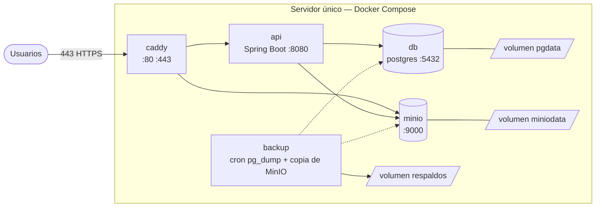

| Servicio | Imagen / forma | Notas |
|---|---|---|
| `caddy` | Contenedor oficial de Caddy | HTTPS automático (requiere dominio, P-03), sirve la SPA compilada, `/api` → API, `/media` → MinIO (solo lectura) |
| `api` | Imagen propia (JRE 21) | Configuración por variables de entorno; `restart: unless-stopped`; `/actuator/health` |
| `db` | `postgres` | Volumen persistente; puerto no expuesto fuera de la red de Docker |
| `minio` | Imagen S3 compatible | Bucket `trina-media` con lectura pública solo del prefijo `negocios/`; consola no expuesta |
| `backup` | Contenedor con cron | `pg_dump` diario + copia del volumen de MinIO; retención de 7 días (RNF-10) |

**Entornos.** *Local* (cada desarrollador): el mismo Compose con perfil `dev` que añade un servidor de correo de pruebas y datos de demostración. *Pruebas/demo*: el servidor único con HTTPS. Los secretos viven en un archivo `.env` fuera del repositorio.

**Límite de almacenamiento.** MinIO es software autoalojado: el límite real es el disco del servidor, no una "capa gratuita". Se vigila el uso de disco y se aplican los límites de RNF-05. Como la distribución de MinIO puede cambiar, todo acceso pasa por `StoragePort`; sustituirlo por otro almacenamiento compatible con S3 solo afecta un adaptador.

---
## 3. Modelado UML

### 3.1 Diagrama de casos de uso

El Cliente hereda todo lo que puede hacer el Visitante.

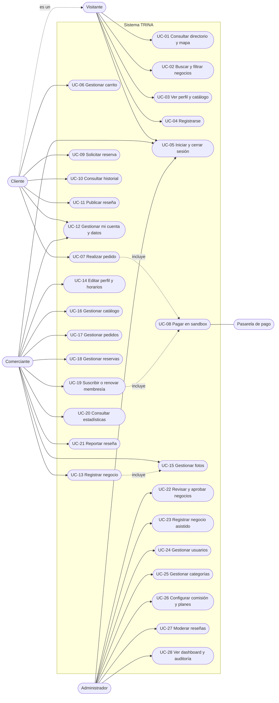

| Caso de uso | RF | Actor principal |
|---|---|---|
| UC-01 Consultar directorio y mapa | RF-08, 09, 24 | Visitante |
| UC-02 Buscar y filtrar negocios | RF-20 a 23 | Visitante |
| UC-03 Ver perfil y catálogo | RF-10, 14, 17, 18 | Visitante |
| UC-04 Registrarse | RF-01, 48 | Visitante |
| UC-05 Iniciar y cerrar sesión | RF-02, 03, 05 | Todos |
| UC-06 Gestionar carrito | RF-30 | Cliente |
| UC-07 Realizar pedido | RF-25, 32 | Cliente |
| UC-08 Pagar en sandbox | RF-28, 29 | Cliente / Comerciante |
| UC-09 Solicitar reserva | RF-26 | Cliente |
| UC-10 Consultar historial | RF-31 | Cliente |
| UC-11 Publicar reseña | RF-38 | Cliente |
| UC-12 Gestionar mi cuenta y datos | RF-48, 49 | Cliente / Comerciante |
| UC-13 Registrar negocio | RF-06 | Comerciante |
| UC-14 Editar perfil y horarios | RF-11, 13, 14 | Comerciante |
| UC-15 Gestionar fotos | RF-12 | Comerciante |
| UC-16 Gestionar catálogo | RF-15 a 19 | Comerciante |
| UC-17 Gestionar pedidos | RF-27, 32 | Comerciante |
| UC-18 Gestionar reservas | RF-27, 32 | Comerciante |
| UC-19 Suscribir o renovar membresía | RF-33 a 36 | Comerciante |
| UC-20 Consultar estadísticas | RF-40, 42 | Comerciante |
| UC-21 Reportar reseña | RF-39 | Comerciante |
| UC-22 Revisar y aprobar negocios | RF-07 | Administrador |
| UC-23 Registrar negocio asistido | RF-47 | Administrador |
| UC-24 Gestionar usuarios | RF-43 | Administrador |
| UC-25 Gestionar categorías | RF-44 | Administrador |
| UC-26 Configurar comisión y planes | RF-45 | Administrador |
| UC-27 Moderar reseñas | RF-39 | Administrador |
| UC-28 Ver dashboard y auditoría | RF-41, 46 | Administrador |

### 3.2 Diagrama de clases (dominio)

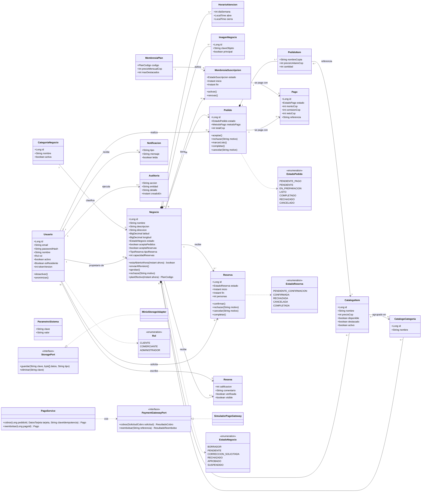

> `ParametroSistema` y los demás enumerados (`EstadoPago`, `EstadoSuscripcion`, `MetodoPago`, `TipoReserva`, `PlanCodigo`) siguen el mismo patrón y se omiten de las relaciones para no saturar el diagrama.

### 3.3 Diagramas de estado

Las tablas de transiciones con actores y condiciones están en el SRS §5.1. Los diagramas se dibujan como diagramas de flujo (cada recuadro es un estado y cada flecha una transición) para que se visualicen sin problemas en GitHub, GitLab y VS Code, incluso con ciclos de reenvío.

**Negocio**

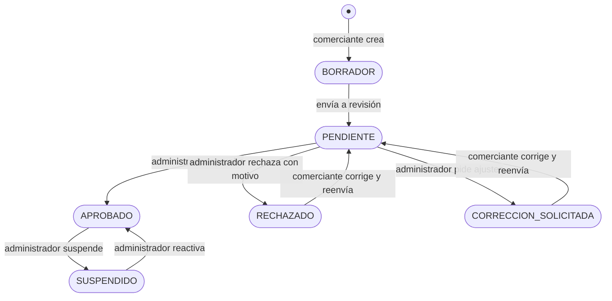

**Pedido**

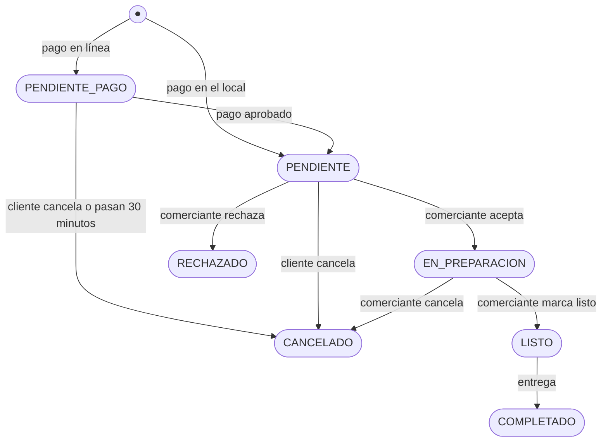

**Reserva**

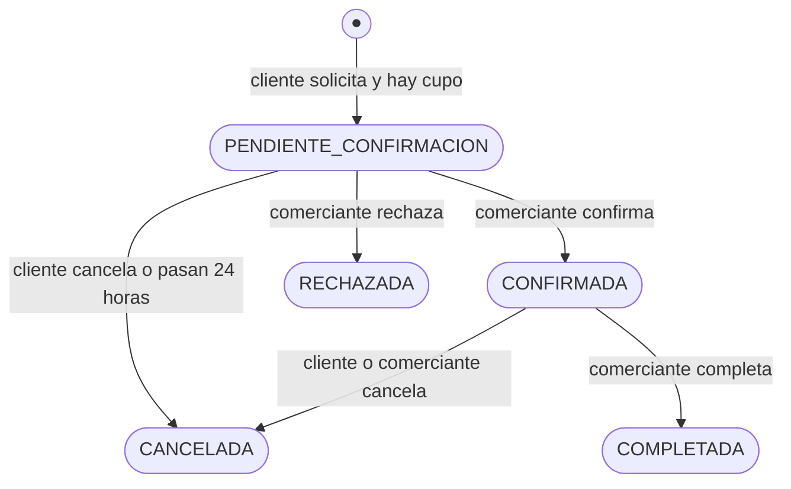

**Pago**

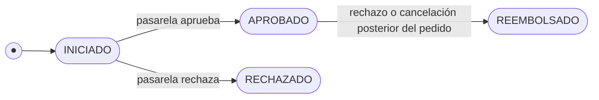

**Suscripción de membresía**

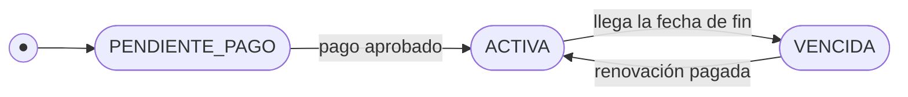

### 3.4 Diagramas de secuencia

#### 3.4.1 Inicio de sesión y acceso con JWT (RF-02, RF-04)

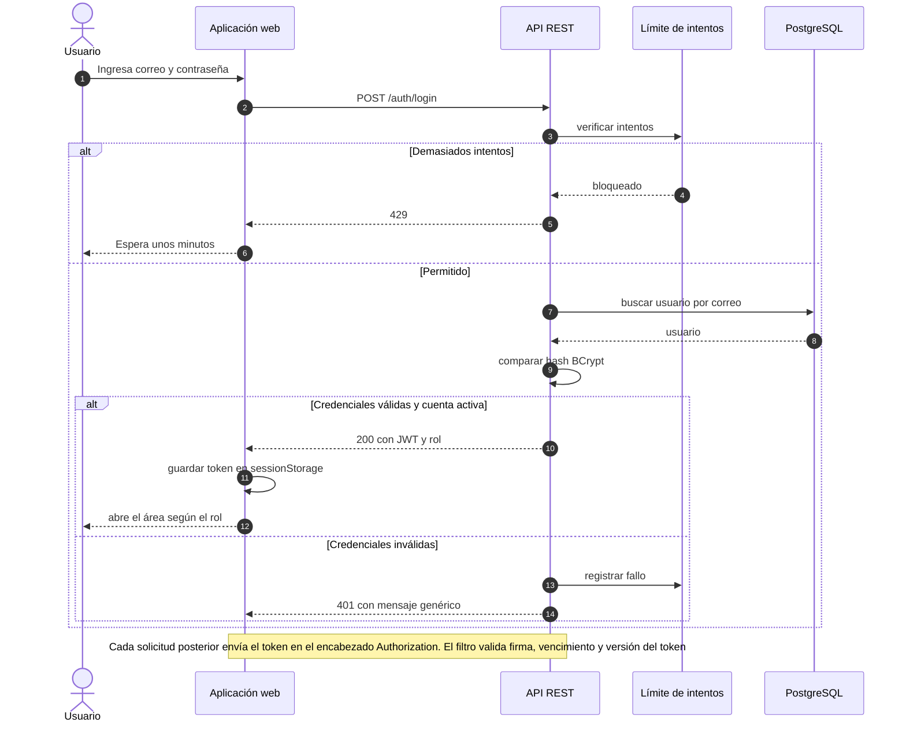

#### 3.4.2 Pedido con pago en sandbox y atención del comerciante (RF-25, 27, 28, 29, 32)

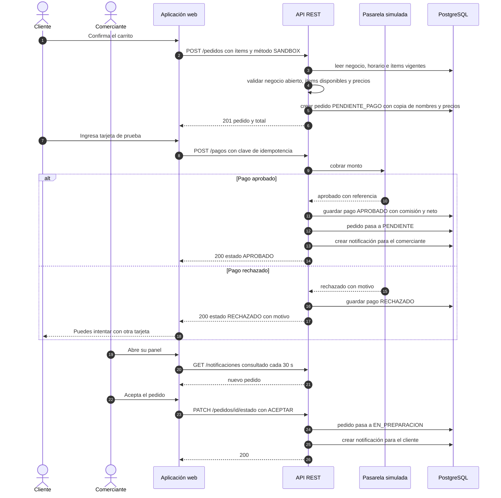

#### 3.4.3 Reserva con control de capacidad (RF-26, 27)

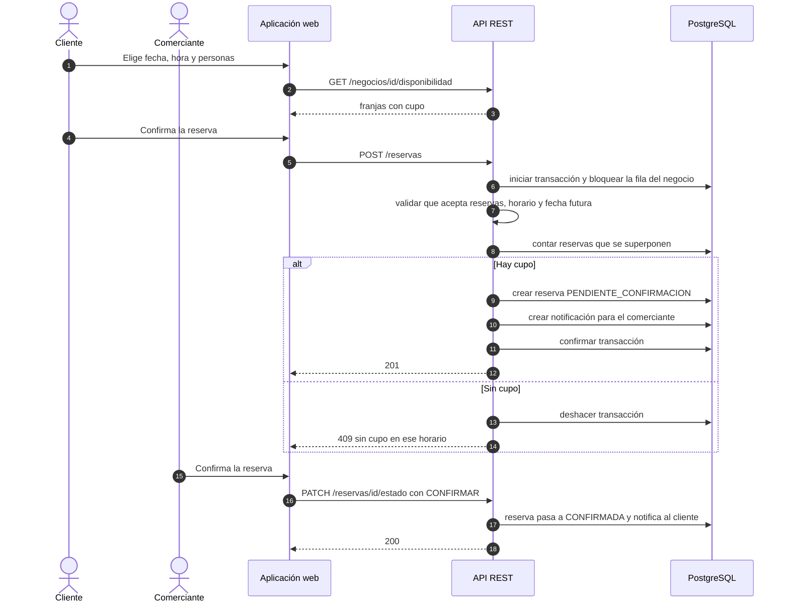

#### 3.4.4 Suscripción a la membresía Destacada (RF-33 a 37)

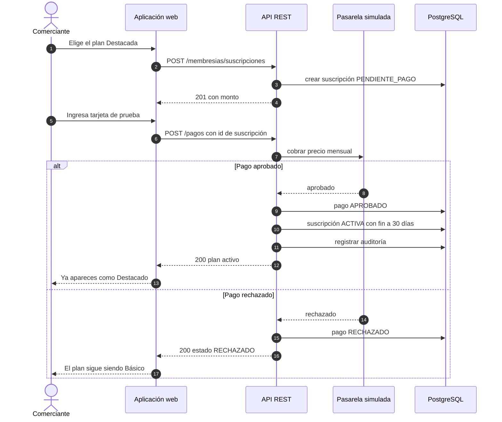

#### 3.4.5 Alta de negocio, fotos y aprobación (RF-06, 07, 12)

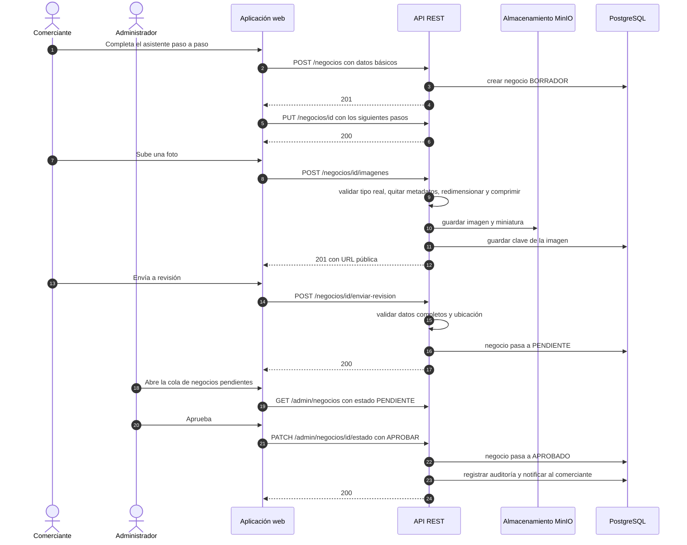

---
## 4. Modelo de datos

### 4.1 Diagrama entidad-relación

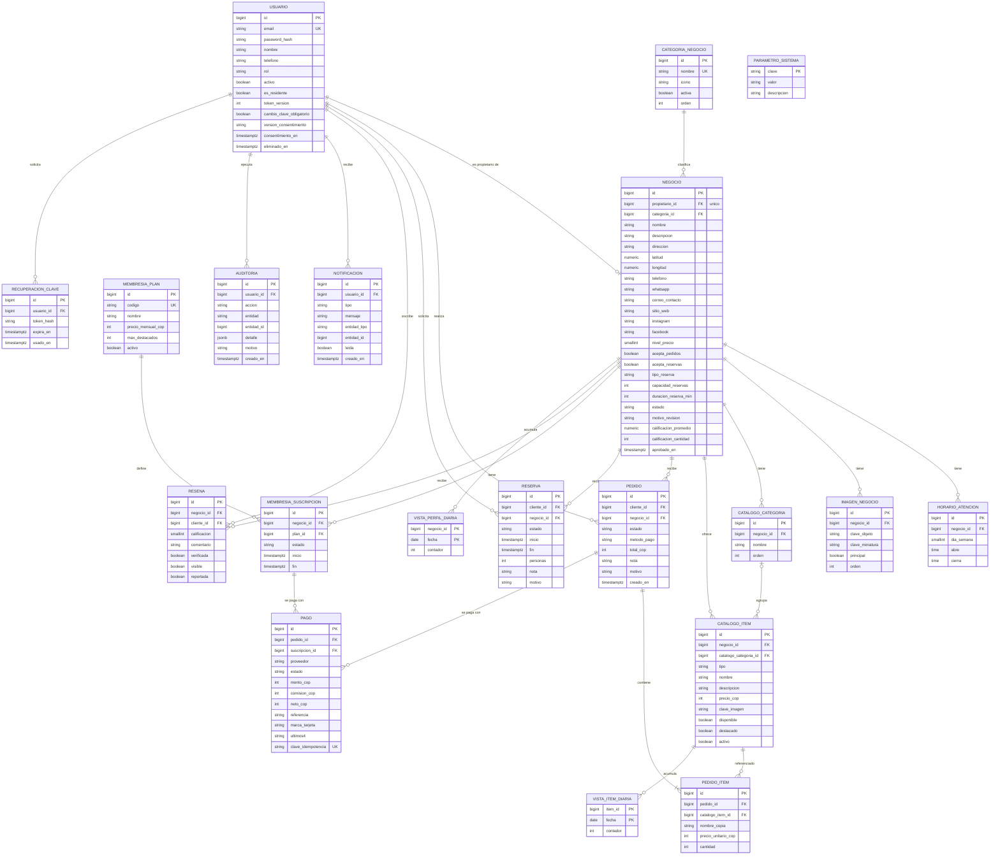

### 4.2 Convenciones y restricciones

| Tema | Regla |
|---|---|
| Claves y nombres | `BIGINT` autogenerado; tablas y columnas en `snake_case` y en español |
| Dinero | `INTEGER` en pesos (COP), sin decimales (RN-02) |
| Tiempo | `TIMESTAMPTZ` en UTC; la presentación y las reglas de horario usan `America/Bogota` |
| Rol | Columna de texto con restricción (`CLIENTE`, `COMERCIANTE`, `ADMINISTRADOR`); los roles son fijos, no hay tabla |
| Auditoría de fila | `creado_en`, `actualizado_en`, `creado_por`, `actualizado_por` en negocio, ítem, pedido, reserva, suscripción y parámetros |
| Bajas | `catalogo_item.activo` (baja lógica); usuarios eliminados se anonimizan y se marcan con `eliminado_en` |
| Unicidad | `usuario.email` (sin distinguir mayúsculas), `negocio.propietario_id`, `resena(negocio_id, cliente_id)`, `pago.clave_idempotencia` |
| Validaciones en BD | `precio_cop > 0`; `calificacion` entre 1 y 5; latitud −90..90 y longitud −180..180; en `pago` exactamente uno entre `pedido_id` y `suscripcion_id`; `nivel_precio` entre 1 y 3 |
| Migraciones | Flyway; una migración por cambio; nunca se edita una migración aplicada |
| Copias de precio | `pedido_item` guarda `nombre_copia` y `precio_unitario_cop` (RN-03) |

### 4.3 Índices

| Índice | Propósito | RF |
|---|---|---|
| `usuario(lower(email))` único | Login y duplicados | RF-01, 02 |
| `negocio(estado)`, `negocio(categoria_id)` | Directorio público y filtro por categoría | RF-08, 21 |
| `negocio(latitud, longitud)` | Recorte previo a cálculos de distancia y mapa | RF-09, 22, 24 |
| `negocio` con `unaccent(lower(nombre))` (trigram opcional) | Búsqueda por texto | RF-20 |
| `horario_atencion(negocio_id, dia_semana)` | "Abierto ahora" | RF-13, 23 |
| `catalogo_item(negocio_id, activo, disponible)` | Catálogo público | RF-17 |
| `pedido(cliente_id, estado)` y `pedido(negocio_id, estado, creado_en)` | Historial y bandeja del comerciante | RF-27, 31 |
| `reserva(negocio_id, inicio, fin)` | Conteo de reservas superpuestas | RF-26 |
| `pago(pedido_id)`, `pago(suscripcion_id)` | Consulta por destino | RF-28 |
| `membresia_suscripcion(negocio_id, estado, fin)` | Plan efectivo | RF-35, 37 |
| `resena(negocio_id, visible)` | Promedio y listado | RF-38 |
| `notificacion(usuario_id, leida, creado_en)` | Campana de notificaciones | RF-32 |
| `auditoria(creado_en, usuario_id, entidad)` | Consultas de trazabilidad | RF-46 |

### 4.4 Datos semilla (migración inicial)

| Dato | Valor |
|---|---|
| Categorías | Restaurantes, Cafés, Hospedajes, Artesanías, Tiendas, Servicios, Experiencias y turismo |
| Planes | `BASICA` (gratis) y `DESTACADA` (de pago) |
| Administrador inicial | Creado desde variables de entorno en el primer arranque |
| Parámetros | `comision_pct` = 5 · `destacada_precio_cop` (valor de demostración, P-02) · `max_destacados_basica` = 2 · `max_destacados_destacada` = 6 · `max_imagenes` = 10 · `max_mb_imagen` = 5 · `pedido_expira_min` = 30 · `reserva_expira_horas` = 24 · `municipio_area` (P-05) |

Los valores de comisión, precio y límites son **parámetros de demostración**, editables por el Administrador (RF-45) y pendientes de validación del Product Owner (P-02).

---

## 5. API REST

### 5.1 Convenciones

| Tema | Regla |
|---|---|
| Base | `/api/v1`, JSON UTF-8, fechas ISO 8601 con zona horaria |
| Autenticación | Encabezado `Authorization: Bearer <JWT>` |
| Roles en las tablas | **P** público · **C** Cliente · **M** Comerciante · **A** Administrador |
| Paginación | `page` (desde 0) y `size` (máximo 50). Respuesta: `contenido`, `pagina`, `tamano`, `total` |
| Idempotencia | `POST /pagos` exige encabezado `Idempotency-Key` |
| Transiciones de estado | `PATCH .../estado` con `{ "accion": "...", "motivo": "..." }`; el servidor valida la transición contra el SRS §5.1 |
| Documentación | OpenAPI publicado en `/v3/api-docs` y Swagger UI solo en entornos de pruebas |

### 5.2 Autenticación, cuenta y privacidad (RF-01 a 05, 03, 48, 49)

| Endpoint | Rol | Descripción |
|---|---|---|
| `POST /auth/registro` | P | Registra Cliente o Comerciante con consentimiento |
| `POST /auth/login` | P | Emite JWT (límite de intentos) |
| `POST /auth/logout` | Autenticado | Cierre de sesión (el cliente descarta el token) |
| `POST /auth/recuperar-clave` | P | Solicita enlace de recuperación |
| `POST /auth/restablecer-clave` | P | Cambia la clave con el token del enlace |
| `GET /auth/me` | Autenticado | Datos de la sesión actual |
| `PATCH /me` | Autenticado | Edita nombre y teléfono |
| `POST /me/cambiar-clave` | Autenticado | Cambia la clave (exige la actual) |
| `GET /me/datos` | Autenticado | Exporta los datos del titular |
| `DELETE /me` | Autenticado | Elimina y anonimiza la cuenta |
| `GET /politica-privacidad` | P | Texto y versión vigente |

### 5.3 Administración de usuarios y categorías (RF-43, 44, 47)

| Endpoint | Rol | Descripción |
|---|---|---|
| `GET /admin/usuarios` | A | Lista con filtros por rol, estado y texto |
| `POST /admin/usuarios/comerciantes` | A | Crea cuenta de Comerciante con clave temporal |
| `PATCH /admin/usuarios/{id}/estado` | A | Activa o desactiva |
| `PATCH /admin/usuarios/{id}/rol` | A | Asigna rol |
| `GET /categorias` | P | Categorías activas |
| `POST /admin/categorias` · `PUT /admin/categorias/{id}` · `PATCH /admin/categorias/{id}/estado` | A | Gestión de categorías |

### 5.4 Directorio, perfiles y búsqueda (RF-06 a 14, 20 a 24, 37, 47)

| Endpoint | Rol | Descripción |
|---|---|---|
| `GET /negocios` | P | Lista de negocios `APROBADO`. Parámetros: `q`, `categoriaId`, `abiertoAhora`, `nivelPrecio`, `lat`, `lng`, `radioKm`, `orden` (`destacados` por defecto, `cercania`, `nombre`), `page`, `size` |
| `GET /negocios/mapa` | P | Versión ligera para el mapa con los mismos filtros, sin paginar: id, nombre, categoría, coordenadas, abierto y destacado |
| `GET /negocios/{id}` | P | Perfil público; cuenta una visita |
| `GET /negocios/{id}/disponibilidad` | P | Franjas con cupo para una fecha (o noches libres) |
| `GET /mi-negocio` | M | Negocio propio con estado y observaciones |
| `POST /negocios` | M | Crea el negocio en `BORRADOR` (409 si ya tiene uno) |
| `PUT /negocios/{id}` | M propietario / A | Edita datos y contactos; respeta campos bloqueados |
| `PUT /negocios/{id}/horarios` | M propietario / A | Reemplaza las franjas horarias |
| `POST /negocios/{id}/enviar-revision` | M propietario | Valida completitud y pasa a `PENDIENTE` |
| `POST /negocios/{id}/imagenes` | M propietario / A | Sube imagen (multipart) |
| `PATCH /negocios/{id}/imagenes/{imagenId}` | M propietario / A | Define principal u orden |
| `DELETE /negocios/{id}/imagenes/{imagenId}` | M propietario / A | Elimina imagen y objeto |
| `GET /admin/negocios` | A | Lista por estado, con cola de pendientes |
| `POST /admin/negocios` | A | Alta asistida para un Comerciante |
| `PATCH /admin/negocios/{id}/estado` | A | Acciones: `APROBAR`, `RECHAZAR`, `SOLICITAR_CORRECCION`, `SUSPENDER`, `REACTIVAR` |

### 5.5 Catálogo (RF-15 a 19)

| Endpoint | Rol | Descripción |
|---|---|---|
| `GET /negocios/{id}/catalogo` | P | Catálogo agrupado por categoría interna |
| `POST /negocios/{id}/catalogo/items` | M propietario | Crea ítem |
| `PUT /negocios/{id}/catalogo/items/{itemId}` | M propietario | Edita ítem |
| `PATCH /negocios/{id}/catalogo/items/{itemId}/disponibilidad` | M propietario | Disponible o no disponible |
| `PATCH /negocios/{id}/catalogo/items/{itemId}/destacado` | M propietario | Marca destacado (P3; respeta el límite del plan) |
| `DELETE /negocios/{id}/catalogo/items/{itemId}` | M propietario | Baja lógica |
| `POST /negocios/{id}/catalogo/items/{itemId}/vista` | P | Registra una vista del ítem (204) |
| `GET /negocios/{id}/catalogo/categorias` | P | Categorías internas |
| `POST`, `PUT`, `DELETE` sobre `/negocios/{id}/catalogo/categorias[/{catId}]` | M propietario | Gestión de categorías internas |

### 5.6 Pedidos, reservas y pagos (RF-25 a 32)

| Endpoint | Rol | Descripción |
|---|---|---|
| `POST /pedidos` | C | Crea pedido: `negocioId`, `items[{itemId, cantidad}]`, `metodoPago`, `nota` |
| `GET /pedidos` | C / M / A | Historial según rol; filtro `estado` |
| `GET /pedidos/{id}` | C propio / M de su negocio / A | Detalle con historial de estados |
| `PATCH /pedidos/{id}/estado` | C / M | Acciones: `ACEPTAR`, `RECHAZAR`, `MARCAR_LISTO`, `COMPLETAR`, `CANCELAR` |
| `POST /reservas` | C | Crea reserva (FRANJA o ALOJAMIENTO) |
| `GET /reservas` · `GET /reservas/{id}` | C / M / A | Historial y detalle según rol |
| `PATCH /reservas/{id}/estado` | C / M | Acciones: `CONFIRMAR`, `RECHAZAR`, `CANCELAR`, `COMPLETAR` |
| `POST /pagos` | C / M | Cobra un pedido o una suscripción: `destino{tipo,id}`, `tarjeta`. El resultado `APROBADO` o `RECHAZADO` se devuelve con `200` |
| `GET /pagos/{id}` | C / M / A | Estado del pago |
| `GET /notificaciones` | C / M | Lista; filtro `soloNoLeidas` |
| `GET /notificaciones/contador` | C / M | Cantidad de no leídas (consulta cada 30 s) |
| `PATCH /notificaciones/{id}/leida` · `POST /notificaciones/leer-todas` | C / M | Marcar como leídas |

### 5.7 Membresías, reseñas y estadísticas (RF-33 a 42, 45)

| Endpoint | Rol | Descripción |
|---|---|---|
| `GET /membresias/planes` | P | Planes y beneficios |
| `POST /membresias/suscripciones` | M | Crea o renueva (queda `PENDIENTE_PAGO` hasta pagar) |
| `GET /membresias/mi-suscripcion` | M | Vigencia, estado y plan efectivo |
| `PUT /admin/membresias/planes/{id}` | A | Precio y beneficios |
| `GET /negocios/{id}/resenas` | P | Reseñas visibles |
| `POST /negocios/{id}/resenas` · `PUT /resenas/{id}` | C | Publica o edita (P3) |
| `POST /resenas/{id}/reportar` | M | Reporta con motivo (P3) |
| `GET /admin/resenas` · `PATCH /admin/resenas/{id}/visibilidad` | A | Cola de reportadas y moderación (P3) |
| `GET /mi-negocio/estadisticas?dias=7\|30` | M | Visitas, pedidos, reservas e ingresos |
| `GET /mi-negocio/productos-mas-vistos` | M | Top de ítems (parámetros `dias`, `limite`) |
| `GET /admin/estadisticas` | A | Indicadores globales |

### 5.8 Administración y operación (RF-45, 46; RNF-04)

| Endpoint | Rol | Descripción |
|---|---|---|
| `GET /admin/auditoria` | A | Registro con filtros por fecha, usuario, entidad |
| `GET /admin/parametros` · `PUT /admin/parametros/{clave}` | A | Consulta y cambia parámetros (comisión, límites) |
| `GET /actuator/health` | P | Estado del servicio (solo `UP` o `DOWN`) |

### 5.9 Errores

Cuerpo común: `{ "codigo": "...", "mensaje": "...", "campos": [...], "traceId": "...", "timestamp": "..." }`. Los mensajes están escritos para el usuario final (RNF-01).

| Situación | HTTP | `codigo` |
|---|---|---|
| Validación de datos | `400` | `VALIDACION` |
| Sin sesión, token inválido o vencido | `401` | `AUTENTICACION` |
| Sin permiso para el rol o el recurso | `403` | `AUTORIZACION` |
| Recurso inexistente o no publicado | `404` | `NO_ENCONTRADO` |
| Conflicto de estado o de unicidad (correo repetido, transición inválida, sin cupo) | `409` | `CONFLICTO` |
| Regla de negocio incumplida (negocio cerrado, ítem no disponible, campo bloqueado) | `422` | `REGLA_NEGOCIO` |
| Demasiados intentos | `429` | `DEMASIADOS_INTENTOS` |
| Error inesperado | `500` | `INTERNO` |

---
## 6. Seguridad

| Capa | Medida | Requisito |
|---|---|---|
| Transporte | HTTPS obligatorio (Caddy con certificado automático); HSTS; sin puertos de BD ni MinIO expuestos | RNF-03 |
| Autenticación | JWT HS256 firmado con secreto de al menos 256 bits tomado del entorno; vigencia de 60 minutos; reclamos `sub`, `rol`, `ver`, `iat`, `exp` | RF-02, 04 |
| Invalidación | El reclamo `ver` se compara con `usuario.token_version`, que aumenta al desactivar al usuario, cambiar su rol o su contraseña; así los tokens previos dejan de valer sin lista negra | RF-04 E4 |
| Contraseñas | BCrypt; mínimo 8 caracteres con letras y números; recuperación con token de un solo uso, guardado con hash y vigente 30 minutos | RF-01, 03 |
| Fuerza bruta | Bucket4j: 5 intentos por 15 minutos por correo y por IP en login, registro y recuperación; respuesta `429` | RF-02 E4 |
| Autorización | Roles con `@PreAuthorize` y verificación de propiedad en la capa de servicio (el negocio, pedido o reserva pertenece al usuario). Matriz endpoint × rol con pruebas automáticas | RF-04, 11 |
| Validación | Bean Validation en cada DTO; consultas parametrizadas (JPA); escape de salida en el frontend; sanitización de texto libre | RNF-03 |
| Archivos | Tipo real verificado por contenido (no por extensión), tamaño máximo, nombres aleatorios (UUID), metadatos EXIF eliminados, nunca se ejecutan | RF-12; RNF-03 E4 |
| Pagos | El simulador solo acepta tarjetas de prueba; no se persisten número, vencimiento ni CVV; solo marca y últimos 4 dígitos | RF-28 |
| Datos personales | Consentimiento versionado, política visible, exportación y eliminación (anonimización), mínimo de datos, registros sin contraseñas ni tokens | RF-48; RNF-03 |
| Navegador | CORS restringido al dominio de la aplicación; Content-Security-Policy; `X-Content-Type-Options`; el token vive en `sessionStorage` y se descarta al cerrar la pestaña | RNF-03 |
| Secretos | Variables de entorno y archivo `.env` fuera del repositorio; credenciales de MinIO y BD distintas por entorno | RNF-03 |
| Auditoría | Aprobaciones, rechazos, suspensiones, cambios de rol y parámetros, ocultamiento de reseñas, cambios de perfil con valor anterior, inicios de sesión fallidos | RF-46; RNF-06 |
| Dependencias | Análisis de vulnerabilidades en el pipeline (`npm audit` y verificación de dependencias de Maven) | RNF-03 E5 |

---

## 7. Mecanismos de diseño

### 7.1 Pagos simulados (RF-28, RF-29)
El módulo `pago` depende solo de `PaymentGatewayPort`. La implementación por defecto, `SimuladorPagoGateway`, decide el resultado por el número de tarjeta de prueba; añadir un sandbox externo es crear otro adaptador sin tocar el resto.

| Tarjeta de prueba | Resultado |
|---|---|
| `4111 1111 1111 1111` | Aprobado |
| `4000 0000 0000 0002` | Rechazado: fondos insuficientes |
| `4000 0000 0000 0069` | Rechazado: tarjeta vencida |
| `4000 0000 0000 0119` | Error del proveedor (para probar reintentos) |

- **Idempotencia:** `pago.clave_idempotencia` único; repetir la misma clave devuelve el pago original sin cobrar de nuevo.
- **Comisión:** al aprobar un pago de pedido con método `SANDBOX`, `comision = round(monto × porcentaje / 100)` y `neto = monto − comision`; se guardan en `pago`. El porcentaje se lee de `parametro_sistema` en ese momento.
- **Reembolso:** al rechazar o cancelar un pedido pagado, el simulador reembolsa, el pago pasa a `REEMBOLSADO` y la comisión se revierte (los campos del pago quedan en cero).

### 7.2 Almacenamiento de imágenes (RF-12; RNF-05)
1. El frontend envía el archivo por `POST /negocios/{id}/imagenes`.
2. El backend verifica el tipo real (JPG, PNG, WebP), el tamaño (máximo 5 MB) y el número de fotos del negocio (máximo 10).
3. Se elimina EXIF, se redimensiona a un máximo de 1200 px de ancho, se comprime y se genera una miniatura de 400 px.
4. Mediante `StoragePort` se guardan en `negocios/{negocioId}/{uuid}.jpg` y `negocios/{negocioId}/{uuid}_m.jpg`; la base guarda solo las claves.
5. Las URLs públicas se arman como `/media/{clave}`; Caddy las sirve desde MinIO en modo lectura.
6. Al eliminar una foto o un negocio, el objeto se borra tras confirmar la transacción. Un proceso nocturno elimina objetos sin referencia.

### 7.3 Búsqueda y geolocalización (RF-20 a 24)
- **Texto:** coincidencia sin tildes ni mayúsculas con `unaccent(lower(...))` sobre nombre del negocio, nombre de la categoría y nombres de ítems activos.
- **Distancia:** sin PostGIS. Con unos 200 negocios basta la fórmula de Haversine en SQL, con recorte previo por rectángulo (latitud y longitud):

```sql
SELECT n.id,
       6371 * acos(least(1,
         cos(radians(:lat)) * cos(radians(n.latitud)) * cos(radians(n.longitud) - radians(:lng))
       + sin(radians(:lat)) * sin(radians(n.latitud)))) AS distancia_km
FROM negocio n
WHERE n.estado = 'APROBADO'
  AND n.latitud  BETWEEN :latMin AND :latMax
  AND n.longitud BETWEEN :lngMin AND :lngMax
ORDER BY distancia_km;
```

- **Orden por defecto:** primero los negocios con plan efectivo DESTACADA y luego por nombre. Con `orden=cercania` manda la distancia (RF-37 E3).
- **Mapa:** `GET /negocios/mapa` devuelve solo lo necesario para dibujar marcadores; el frontend los agrupa.

### 7.4 Horarios y estado "abierto ahora" (RF-13, 23)
- Las franjas se guardan por día de la semana con `abre` y `cierra`. Una franja con `cierra <= abre` se interpreta como cierre después de medianoche.
- Para evaluar el instante `t` en `America/Bogota`: el negocio está abierto si existe una franja del día actual con `abre <= t < cierra` (o `t >= abre` si cruza medianoche), o una franja del día anterior que cruzó medianoche y aún no ha cerrado (`t < cierra`).
- Se calcula en el servicio sobre el conjunto ya filtrado (no más de 200 negocios), no en SQL.
- El mismo cálculo valida los pedidos (negocio abierto) y las reservas de tipo FRANJA (hora dentro del horario).

### 7.5 Reservas y concurrencia (RF-26; RN-07)
- Toda reserva se guarda como intervalo `[inicio, fin)`: FRANJA usa la duración configurada del negocio; ALOJAMIENTO va de la noche de entrada a la de salida.
- Al crear una reserva, dentro de una transacción se bloquea la fila del negocio (`SELECT ... FOR UPDATE`), se cuentan las reservas `PENDIENTE_CONFIRMACION` y `CONFIRMADA` que se superponen y se inserta solo si el conteo es menor que `capacidad_reservas`. El bloqueo por negocio es suficiente para el volumen esperado y evita sobreventa.

### 7.6 Plan efectivo (RN-05)

```sql
SELECT COALESCE(
  (SELECT p.codigo
     FROM membresia_suscripcion s JOIN membresia_plan p ON p.id = s.plan_id
    WHERE s.negocio_id = :negocioId AND s.estado = 'ACTIVA' AND s.fin > now()
    ORDER BY s.fin DESC LIMIT 1),
  'BASICA') AS plan_efectivo;
```

Se calcula al consultar, por lo que no depende de que un proceso programado corra a tiempo. El proceso programado solo actualiza el campo `estado` a `VENCIDA` para reportes.

### 7.7 Estadísticas (RF-40 a 42)
- Cada visita al perfil y cada vista de ítem incrementa un contador diario con `INSERT ... ON CONFLICT (negocio_id, fecha) DO UPDATE SET contador = contador + 1`; así la tabla crece por día y no por visita.
- Pedidos, reservas e ingresos se consultan directamente de sus tablas con índices; no se usan vistas materializadas.
- El indicador de usuarios visitantes (KPI del Plan) sale de `usuario.es_residente`.

### 7.8 Notificaciones (RF-32)
- Cada cambio relevante crea una fila en `notificacion` dentro de la misma transacción que el cambio.
- El frontend consulta `/notificaciones/contador` cada 30 segundos mientras haya sesión; al abrir la campana carga la lista.
- El correo (P3) se envía de forma asíncrona mediante `MailPort` (Spring Mail), con un reintento simple.

### 7.9 Tareas programadas

| Tarea | Frecuencia | Qué hace |
|---|---|---|
| Expirar pedidos sin pago | Cada 5 min | `PENDIENTE_PAGO` con más de 30 min pasa a `CANCELADO` |
| Expirar reservas sin respuesta | Cada 15 min | `PENDIENTE_CONFIRMACION` con más de 24 h pasa a `CANCELADA` y notifica |
| Marcar suscripciones vencidas | Cada hora | `ACTIVA` con `fin` pasado pasa a `VENCIDA`; avisos de 7 días |
| Limpiar objetos huérfanos | Diaria, 03:00 | Compara claves de MinIO con la base y borra las que no tienen referencia |
| Limpiar tokens de recuperación | Diaria, 04:00 | Elimina tokens vencidos o usados |

### 7.10 Errores, registros y observabilidad
- Manejador global de excepciones que devuelve el cuerpo común de §5.9 con `traceId`.
- Registros en JSON con `traceId`, sin datos personales sensibles; niveles configurables por entorno.
- `/actuator/health` para la verificación de disponibilidad (RNF-04) y para el reinicio automático de contenedores.

---

## 8. Decisiones de arquitectura (ADR)

**ADR-01 · Monolito modular en Spring Boot.** *Contexto:* 3 personas, 14 días de construcción. *Decisión:* un solo despliegue con módulos por funcionalidad y capas web, aplicación y dominio. *Consecuencias:* despliegue simple; los límites entre módulos se cuidan por convención y revisión de código.

**ADR-02 · PostgreSQL sin PostGIS.** *Contexto:* menos de 200 negocios. *Decisión:* latitud y longitud numéricas, recorte por rectángulo y Haversine en SQL; extensión `unaccent` para búsqueda. *Consecuencias:* menos configuración; si el volumen creciera, se migra a PostGIS sin cambiar la API.

**ADR-03 · Almacenamiento S3 compatible con MinIO tras `StoragePort`.** *Contexto:* el Acta exige MinIO y la distribución de MinIO puede cambiar. *Decisión:* acceso solo por el puerto, con bucket de lectura pública limitada al prefijo de imágenes. *Consecuencias:* sustituir el almacenamiento solo cambia un adaptador; el límite real es el disco del servidor.

**ADR-04 · Aplicación web React única, responsiva y con áreas por rol.** *Contexto:* sin apps nativas; usuarios principalmente en teléfono. *Decisión:* SPA con React, Vite y TypeScript; rutas protegidas por rol; Tailwind CSS; TanStack Query para datos. *Consecuencias:* una sola base de código para las tres áreas; cualquier otro framework requiere un nuevo ADR (P-04).

**ADR-05 · JWT stateless de 60 minutos con versión de token.** *Contexto:* roles fijos y necesidad de invalidar al desactivar usuarios. *Decisión:* HS256, token en `sessionStorage`, sin refresh token en esta versión y reclamo `ver` comparado con `usuario.token_version`. *Consecuencias:* la sesión expira a la hora; el riesgo de XSS se reduce con CSP y sanitización; añadir refresh token queda como mejora.

**ADR-06 · Mapa en el cliente con Leaflet y teselas de OpenStreetMap.** *Decisión:* el backend entrega coordenadas y metadatos; el navegador dibuja y agrupa. *Consecuencias:* sin carga de renderizado en el servidor; hay que mostrar la atribución y vigilar el volumen de uso de las teselas.

**ADR-07 · Pagos tras `PaymentGatewayPort` con simulador interno por defecto.** *Contexto:* sin dinero real y con riesgo de depender de terceros o de webhooks. *Decisión:* simulador con tarjetas de prueba e idempotencia; un adaptador a un sandbox externo es opcional. *Consecuencias:* demostraciones predecibles y sin dependencia externa.

**ADR-08 · Carrito en el navegador.** *Decisión:* el carrito vive en el estado de la aplicación y en `localStorage`; el servidor valida precios y disponibilidad al crear el pedido. *Consecuencias:* menos entidades y endpoints; el carrito no se comparte entre dispositivos.

**ADR-09 · Reservas como intervalos con bloqueo por negocio.** *Decisión:* un único modelo `[inicio, fin)` para FRANJA y ALOJAMIENTO y bloqueo de la fila del negocio al crear. *Consecuencias:* evita sobreventa con poco código; limita el paralelismo de reservas del mismo negocio, aceptable al volumen previsto.

**ADR-10 · Estadísticas con contadores diarios.** *Decisión:* contadores por día para perfil e ítem; el resto se consulta de las tablas de negocio. *Consecuencias:* crecimiento controlado y consultas rápidas; no hay detalle por visita.

**ADR-11 · Despliegue con Docker Compose y Caddy.** *Contexto:* sin equipo de infraestructura. *Decisión:* un servidor con Compose (API, BD, MinIO, Caddy y respaldo). *Consecuencias:* entornos reproducibles y HTTPS automático; el servidor y el dominio dependen de P-03.

**ADR-12 · Contrato OpenAPI primero y migraciones Flyway.** *Decisión:* el contrato de la API v1 se acuerda y congela al inicio del Sprint 4; el frontend desarrolla contra simulaciones del contrato; toda la estructura de la BD se versiona con Flyway. *Consecuencias:* frontend y backend avanzan en paralelo; cambios de contrato posteriores se negocian entre el backend y el frontend.

**ADR-13 · Un negocio por comerciante (D-01).** *Decisión:* restricción única sobre `negocio.propietario_id`. *Consecuencias:* los endpoints `/mi-negocio` no necesitan identificador; abrir a varios negocios exigiría cambiar modelo y API.

---

## 9. Riesgos técnicos

Escala del Plan de Trabajo: probabilidad e impacto de 1 a 5; nivel = P × I (1–5 bajo, 6–10 moderado, 11–15 alto, 16–25 muy alto).

| ID | Riesgo | P | I | Nivel | Mitigación | Responsable |
|---|---|:-:|:-:|:-:|---|---|
| R-01 | Calendario comprimido: solo 14 días de construcción entre el fin del diseño y el hito | 5 | 5 | 25 | Esqueleto técnico en el Sprint 3; construir P1 antes que P2 y P3; contrato OpenAPI congelado; acuerdo escrito para recortar P2 | Daniela |
| R-02 | Cuello de botella en frontend: tres áreas para una persona | 4 | 4 | 16 | Componentes compartidos; panel admin con tablas genéricas; simulaciones del contrato; Daniela apoya el panel admin al cerrar la API P1; David apoya con datos de demostración y pruebas E2E | Juan David |
| R-03 | Poca experiencia con Spring Security y JWT | 3 | 4 | 12 | Plantilla de seguridad en el Sprint 3; matriz endpoint × rol con pruebas automáticas; revisión cruzada | Daniela |
| R-04 | Baja adopción o datos incompletos de comerciantes (afecta la demostración) | 3 | 5 | 15 | Alta asistida (RF-47); datos de demostración; asistente por pasos; acompañamiento a 5 comercios piloto | Juan David |
| R-05 | Servidor o dominio no disponible a tiempo | 3 | 4 | 12 | Cerrar P-03 antes del 16 oct; plan B: demostración con Docker Compose local | David |
| R-06 | Cambios en la distribución de MinIO | 2 | 3 | 6 | `StoragePort`; adaptador alternativo S3 compatible o disco local para la demostración | David |
| R-07 | Rendimiento del mapa con muchos marcadores | 2 | 3 | 6 | Endpoint ligero, agrupación de marcadores, recorte por rectángulo | Juan David |
| R-08 | Sobreventa en reservas concurrentes | 2 | 3 | 6 | Bloqueo por negocio y prueba de concurrencia | Daniela |
| R-09 | Incumplimiento de la Ley 1581 y de la política de la UQ | 2 | 4 | 8 | Consentimiento versionado, exportación y eliminación, mínimo de datos; alinear con la política de la UQ (P-07) | Daniela |
| R-10 | Pérdida de datos por despliegue manual | 2 | 4 | 8 | Compose, respaldo diario, restauración probada antes del hito | David |
| R-11 | Uso excesivo de las teselas públicas de OpenStreetMap | 2 | 2 | 4 | Atribución, bajo volumen, proveedor alterno si hiciera falta | Juan David |
| R-12 | Municipio piloto desalineado con el Acta (P-01) | 2 | 3 | 6 | Confirmar con el Supervisor antes del 9 oct | Daniela |

---

## 10. Estrategia de construcción

### 10.1 Calendario técnico

| Sprint | Fechas | Entregable técnico |
|---|---|---|
| S2 · E2 | 28 sep–11 oct | SRS definitivo |
| S3 · E3 | 12–25 oct | Este documento, `trina-ui-design.md`, SRS aprobado y **esqueleto técnico** (§10.2) |
| S4 · E4 | 26 oct–8 nov | Desarrollo e integración: todos los P1 y los P2 posibles (§10.3) |
| **Hito** | **9 nov** | **100 % de ejecución** |
| S5 · E5 | 9–15 nov | Pruebas integrales, corrección de errores, manuales, informe, modelo de negocio y P3 si hay capacidad |
| Sustentación | 16 nov | Entrega final |

### 10.2 Esqueleto técnico (Sprint 3)
Se construye en paralelo al diseño para que las semanas 6–7 se dediquen a funcionalidad y no a configuración:
1. Repositorio con `backend/`, `frontend/`, `deploy/` y `docs/`; ramas y revisión de código configuradas.
2. Docker Compose completo (API, BD, MinIO, Caddy) y perfil `dev` con servidor de correo de pruebas.
3. Migración inicial de Flyway con las tablas y los datos semilla de §4.4.
4. Autenticación completa: registro, login, `me`, roles, límite de intentos, manejador de errores.
5. Aplicación React con rutas por rol, diseño base, cliente de API y manejo de errores.
6. Contrato OpenAPI v1 acordado y publicado; el frontend desarrolla contra simulaciones.
7. Pipeline de compilación y pruebas; despliegue al servidor con HTTPS.

**Criterio de terminado:** una persona se registra, inicia sesión y entra a su área según el rol, en el servidor desplegado.

### 10.3 Orden de construcción del Sprint 4

| Semana | Prioridad | Backend (Daniela) | Frontend y UI (Juan David) | BD, infraestructura y QA (David) |
|---|---|---|---|---|
| 6 (26 oct–1 nov) | P1 | Negocio y revisión, imágenes con `StoragePort`, catálogo, búsqueda, mapa, pedidos y pago simulado | Directorio, mapa, perfil, asistente del negocio, catálogo, carrito y pago | Adaptador MinIO, datos de demostración, pruebas de integración de directorio y pedidos, respaldo diario |
| 7 (2–8 nov) | P1, luego P2 | Reservas, membresías, estadísticas, notificaciones, administración, cuenta y privacidad | Reservas, membresía, estadísticas, panel admin, notificaciones | Pruebas de integración y E2E de los flujos críticos, rendimiento, prueba de restauración |
| 8–9 nov | Cierre del hito | Corrección de errores | Ajustes de usabilidad | Verificación contra la lista de criterios de hito (SRS §8.2) |

Si a mitad de la semana 7 hay retraso, se recortan primero los P3, luego los P2 con acuerdo del Supervisor; nunca los P1.

### 10.4 Estrategia de pruebas

| Nivel | Qué cubre | Herramientas |
|---|---|---|
| Unitarias | Reglas puras: comisión, plan efectivo, horarios, transiciones de estado | JUnit 5, Mockito |
| Integración | API con PostgreSQL real, seguridad, transacciones y concurrencia de reservas | Spring Boot Test, Testcontainers |
| Autorización | Matriz endpoint × rol × propiedad del recurso | Spring Security Test |
| Contrato | El OpenAPI refleja la API real | springdoc |
| Extremo a extremo | Registro y alta del negocio; búsqueda y mapa; pedido con pago; reserva; membresía; aprobación del Administrador | Playwright |
| Aceptación | Cada escenario *Dado/Cuando/Entonces* del SRS | Lista de aceptación en la revisión del sprint |
| No funcionales | Rendimiento y accesibilidad (Lighthouse), carga ligera de la API, compatibilidad de navegadores, usabilidad | Lighthouse, k6, prueba con comerciantes |

### 10.5 Trabajo en Git
Ramas cortas `feature/RF-xx-descripción`; solicitud de integración con al menos una revisión de otro integrante y pipeline en verde; los mensajes de commit mencionan el RF y la tarea de Jira.

### 10.6 Datos de demostración
Al menos 15 negocios (reales de los comercios piloto cuando sea posible, ficticios para completar) en 5 o más categorías, con 40 ítems, un negocio con plan Destacada, usuarios de cada rol y pedidos y reservas en distintos estados.

---

## 11. Trazabilidad

### 11.1 RF → casos de uso → módulo → endpoints

| RF | UC | Módulo | Endpoints principales |
|---|---|---|---|
| RF-01 | UC-04 | `auth` | `POST /auth/registro` |
| RF-02 | UC-05 | `auth` | `POST /auth/login` |
| RF-03 | UC-05 | `auth` | `POST /auth/recuperar-clave`, `/auth/restablecer-clave` |
| RF-04 | Todos | `compartido` | Filtro JWT y `@PreAuthorize` en todos los endpoints |
| RF-05 | UC-05 | `auth` | `POST /auth/logout` |
| RF-06 | UC-13 | `negocio` | `POST /negocios`, `PUT /negocios/{id}`, `POST /negocios/{id}/enviar-revision`, `GET /mi-negocio` |
| RF-07 | UC-22 | `negocio`, `admin` | `GET /admin/negocios`, `PATCH /admin/negocios/{id}/estado` |
| RF-08 | UC-01 | `negocio` | `GET /negocios` |
| RF-09 | UC-01 | `negocio` | `GET /negocios/mapa` |
| RF-10 | UC-03 | `negocio`, `estadistica` | `GET /negocios/{id}` |
| RF-11 | UC-14 | `negocio` | `PUT /negocios/{id}` |
| RF-12 | UC-15 | `almacenamiento`, `negocio` | `POST`, `PATCH`, `DELETE /negocios/{id}/imagenes` |
| RF-13 | UC-14 | `negocio` | `PUT /negocios/{id}/horarios` |
| RF-14 | UC-14, UC-03 | `negocio` | `PUT /negocios/{id}`, `GET /negocios/{id}` |
| RF-15 | UC-16 | `catalogo` | `POST /negocios/{id}/catalogo/items` |
| RF-16 | UC-16 | `catalogo` | `PUT`, `PATCH .../disponibilidad`, `DELETE .../items/{itemId}` |
| RF-17 | UC-03 | `catalogo`, `estadistica` | `GET /negocios/{id}/catalogo`, `POST .../items/{itemId}/vista` |
| RF-18 | UC-16 | `catalogo` | `/negocios/{id}/catalogo/categorias` |
| RF-19 | UC-16 | `catalogo` | `PATCH .../items/{itemId}/destacado` |
| RF-20 | UC-02 | `negocio` | `GET /negocios?q=` |
| RF-21 | UC-02 | `negocio` | `GET /negocios?categoriaId=` |
| RF-22 | UC-02 | `negocio` | `GET /negocios?lat&lng&radioKm&orden=cercania` |
| RF-23 | UC-02 | `negocio` | `GET /negocios?abiertoAhora&nivelPrecio` |
| RF-24 | UC-01 | `negocio` | `GET /negocios/mapa` |
| RF-25 | UC-07 | `pedido` | `POST /pedidos` |
| RF-26 | UC-09 | `reserva` | `POST /reservas`, `GET /negocios/{id}/disponibilidad` |
| RF-27 | UC-17, UC-18 | `pedido`, `reserva` | `PATCH /pedidos/{id}/estado`, `PATCH /reservas/{id}/estado` |
| RF-28 | UC-08 | `pago` | `POST /pagos`, `GET /pagos/{id}` |
| RF-29 | UC-08 | `pago` | Cálculo interno en `POST /pagos` |
| RF-30 | UC-06 | Frontend | Validación final en `POST /pedidos` |
| RF-31 | UC-10 | `pedido`, `reserva` | `GET /pedidos`, `GET /reservas` |
| RF-32 | UC-07, UC-17, UC-18 | `notificacion` | `GET /notificaciones`, `/notificaciones/contador` |
| RF-33 | UC-19 | `membresia` | `GET /membresias/planes` |
| RF-34 | UC-19 | `membresia`, `pago` | `POST /membresias/suscripciones`, `POST /pagos` |
| RF-35 | UC-19 | `membresia` | `GET /membresias/mi-suscripcion` |
| RF-36 | UC-19 | `membresia` | `POST /membresias/suscripciones` |
| RF-37 | UC-01, UC-02 | `membresia`, `negocio` | `GET /negocios` (orden por defecto) |
| RF-38 | UC-11 | `resena` | `POST /negocios/{id}/resenas`, `PUT /resenas/{id}` |
| RF-39 | UC-21, UC-27 | `resena` | `POST /resenas/{id}/reportar`, `PATCH /admin/resenas/{id}/visibilidad` |
| RF-40 | UC-20 | `estadistica` | `GET /mi-negocio/estadisticas` |
| RF-41 | UC-28 | `admin`, `estadistica` | `GET /admin/estadisticas` |
| RF-42 | UC-20 | `estadistica` | `GET /mi-negocio/productos-mas-vistos` |
| RF-43 | UC-24 | `usuario` | `/admin/usuarios` y subrecursos |
| RF-44 | UC-25 | `admin` | `/admin/categorias` |
| RF-45 | UC-26 | `admin`, `membresia` | `/admin/parametros`, `PUT /admin/membresias/planes/{id}` |
| RF-46 | UC-28 | `admin` | `GET /admin/auditoria` |
| RF-47 | UC-23 | `usuario`, `negocio` | `POST /admin/usuarios/comerciantes`, `POST /admin/negocios` |
| RF-48 | UC-04, UC-12 | `usuario` | `GET /me/datos`, `DELETE /me`, `GET /politica-privacidad` |
| RF-49 | UC-12 | `usuario` | `PATCH /me`, `POST /me/cambiar-clave` |

### 11.2 RNF → mecanismo

| RNF | Mecanismo de diseño |
|---|---|
| RNF-01 | Asistente por pasos, lenguaje simple y alta asistida (`trina-ui-design.md`); prueba de usabilidad |
| RNF-02 | Índices (§4.3), paginación, endpoint ligero del mapa, miniaturas, carga diferida |
| RNF-03 | §6 completo |
| RNF-04 | Compose con reinicio automático, `/actuator/health`, respaldo |
| RNF-05 | §7.2 (compresión, límites, limpieza) |
| RNF-06 | Auditoría (`auditoria` con valor anterior y nuevo) y columnas de autoría |
| RNF-07 | Sistema de diseño accesible y lista de verificación (`trina-ui-design.md`) |
| RNF-08 | Diseño de adelante hacia atrás desde el teléfono, pruebas en navegadores objetivo |
| RNF-09 | Pipeline, Testcontainers, OpenAPI, Flyway, revisión de código (§10) |
| RNF-10 | Contenedor de respaldo (§2.4) y prueba de restauración (§10.3) |
| RNF-11 | Formateo `es-CO`, zona `America/Bogota` en servicio y frontend |
