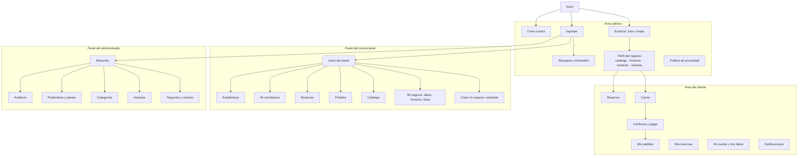
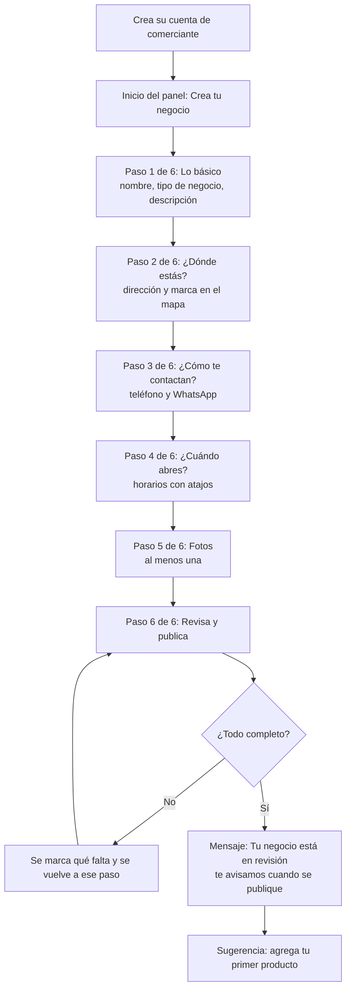
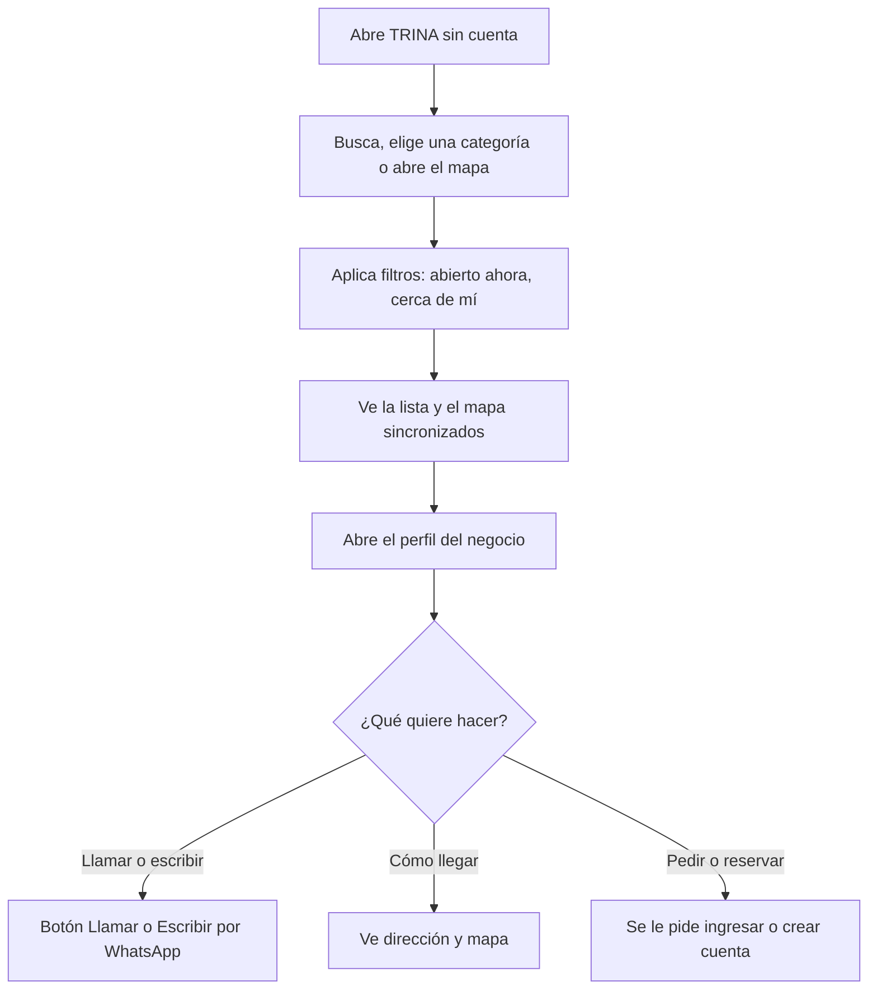
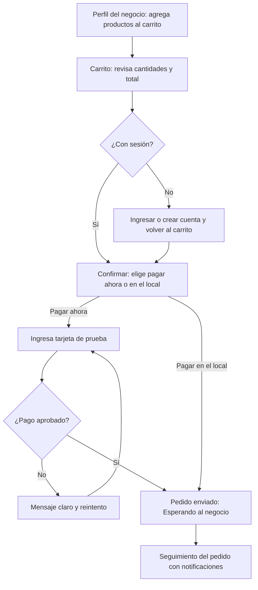
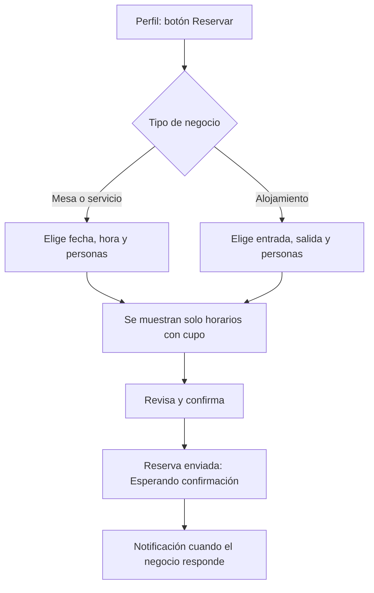
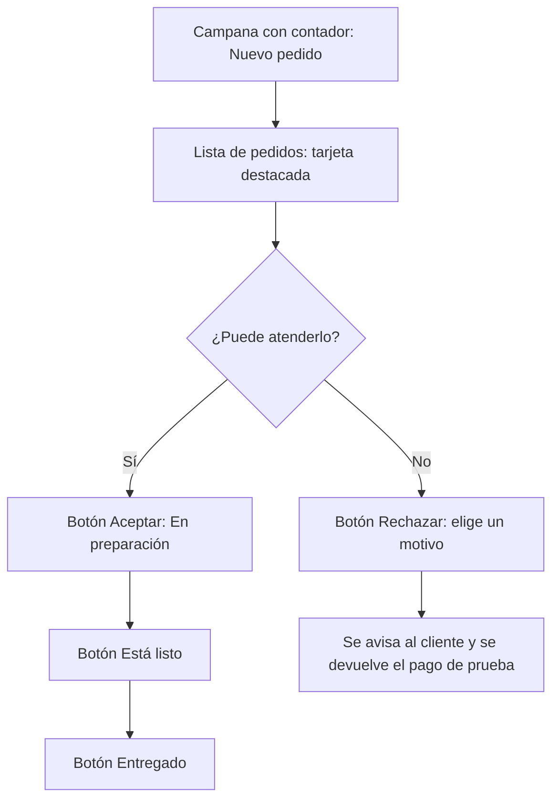

# Diseño de Interfaz y Experiencia de Usuario — Proyecto TRINA

| Atributo | Valor |
|---|---|
| Proyecto | TRINA (VitrinaLocal) |
| Documento | Diseño centrado en el usuario (DCU) de la aplicación web, parte del Componente 3 y del Componente 4 del Acta |
| Versión | 1.0 — Línea base definitiva |
| Fecha | 5 de octubre de 2026 |
| Responsable | Juan David Cardozo Torres (diseño de interfaz) |
| Base | `trina-requirements.md` v1.0 y `trina-design.md` v1.0 |
| Estado | Listo para aprobación del Supervisor |

Los wireframes son de baja fidelidad y están pensados para teléfono (360 px de ancho), que es el dispositivo principal de comerciantes y turistas.

---

## 1. Principios de diseño

Derivados de RNF-01 (usabilidad para baja alfabetización digital), RNF-07 (accesibilidad) y RNF-08 (responsividad).

1. **Teléfono primero.** Se diseña desde 360 px y se amplía hacia tabletas y escritorio.
2. **Una tarea principal por pantalla.** Cada pantalla tiene un botón principal evidente; lo secundario se ve más discreto.
3. **Pasos cortos con progreso visible.** Los procesos largos (alta del negocio, pedido, reserva) se dividen en pasos con indicador "Paso 2 de 6" y botón "Atrás".
4. **Palabras de todos los días.** Sin tecnicismos: "Publicar", no "Enviar a revisión" (a menos que sea necesario); "Fotos", no "Galería de imágenes". Trato de tú, tono cercano y respetuoso.
5. **Icono más texto, siempre.** Ningún icono va solo en las acciones principales.
6. **Mostrar el estado, no esconderlo.** El usuario siempre sabe en qué paso va, qué pasó con su pedido y qué sigue.
7. **Perdonar errores.** Confirmación antes de acciones destructivas, borradores guardados, mensajes de error que dicen cómo arreglarlo.
8. **Ayuda donde se necesita.** Cada campo difícil tiene una línea de ayuda y un ejemplo ("Ej.: Calle 5 # 10-20").
9. **Ligero con mala conexión.** Esqueletos de carga, imágenes en miniatura y carga diferida, sin bloquear la pantalla completa.
10. **Ninguna información solo con color.** Los estados llevan texto e icono además del color.

---

## 2. Arquitectura de información

### 2.1 Mapa del sitio



### 2.2 Rutas y pantallas

| Pantalla | Ruta | Rol | RF |
|---|---|---|---|
| PU-01 Inicio (buscador, categorías, destacados) | `/` | Todos | RF-08, 20, 21, 37 |
| PU-02 Explorar (lista y mapa con filtros) | `/explorar` | Todos | RF-08, 09, 20 a 24 |
| PU-03 Perfil del negocio | `/negocios/:id` | Todos | RF-10, 14, 17, 18, 38 |
| PU-04 Ingresar | `/ingresar` | Visitante | RF-02 |
| PU-05 Crear cuenta | `/registro` | Visitante | RF-01, 48 |
| PU-06 Recuperar y restablecer contraseña | `/recuperar`, `/restablecer/:token` | Visitante | RF-03 |
| PU-07 Política de privacidad | `/privacidad` | Todos | RF-48 |
| PC-01 Carrito | `/carrito` | Cliente | RF-30 |
| PC-02 Confirmar y pagar | `/pedido/confirmar` | Cliente | RF-25, 28 |
| PC-03 Mis pedidos y detalle | `/pedidos`, `/pedidos/:id` | Cliente | RF-31 |
| PC-04 Reservar | `/reservar/:negocioId` | Cliente | RF-26 |
| PC-05 Mis reservas | `/reservas` | Cliente | RF-31 |
| PC-06 Mi cuenta y mis datos | `/cuenta` | Autenticado | RF-48, 49 |
| PC-07 Notificaciones | `/notificaciones` | Autenticado | RF-32 |
| PM-01 Inicio del panel | `/panel` | Comerciante | RF-27, 32, 35, 40 |
| PM-02 Crear mi negocio (asistente) | `/panel/negocio/nuevo` | Comerciante | RF-06, 12, 13 |
| PM-03 Datos y contacto del negocio | `/panel/negocio` | Comerciante | RF-11, 14 |
| PM-04 Horarios | `/panel/negocio/horarios` | Comerciante | RF-13 |
| PM-05 Fotos | `/panel/negocio/fotos` | Comerciante | RF-12 |
| PM-06 Catálogo | `/panel/catalogo` | Comerciante | RF-15 a 19 |
| PM-07 Pedidos | `/panel/pedidos` | Comerciante | RF-27 |
| PM-08 Reservas | `/panel/reservas` | Comerciante | RF-27 |
| PM-09 Mi membresía | `/panel/membresia` | Comerciante | RF-33 a 36 |
| PM-10 Estadísticas | `/panel/estadisticas` | Comerciante | RF-40, 42 |
| PM-11 Reseñas | `/panel/resenas` | Comerciante | RF-39 (P3) |
| PA-01 Resumen | `/admin` | Administrador | RF-41 |
| PA-02 Negocios y revisión | `/admin/negocios` | Administrador | RF-07, 47 |
| PA-03 Usuarios | `/admin/usuarios` | Administrador | RF-43, 47 |
| PA-04 Categorías | `/admin/categorias` | Administrador | RF-44 |
| PA-05 Parámetros y planes | `/admin/parametros` | Administrador | RF-45 |
| PA-06 Reseñas reportadas | `/admin/resenas` | Administrador | RF-39 (P3) |
| PA-07 Auditoría | `/admin/auditoria` | Administrador | RF-46 |

Las rutas protegidas redirigen a `/ingresar` si no hay sesión y muestran "No tienes permiso para ver esta página" si el rol no corresponde.

### 2.3 Navegación

| Área | Móvil | Escritorio |
|---|---|---|
| Pública y cliente | Barra superior con logo y buscador; barra inferior con **Inicio · Explorar · Pedidos · Cuenta** | Barra superior con menú, buscador y carrito |
| Comerciante | Barra inferior con **Inicio · Pedidos · Catálogo · Mi negocio · Más** | Menú lateral fijo |
| Administrador | Menú desplegable (se usa sobre todo en escritorio) | Menú lateral fijo con tablas amplias |

---

## 3. Flujos clave

### 3.1 Alta del negocio por el comerciante (RF-06; meta: 15 minutos o menos)



Cada paso se guarda solo al avanzar (borrador en el servidor), de modo que el comerciante puede salir y retomar donde quedó.

### 3.2 Descubrir y contactar un negocio (turista)



### 3.3 Pedido para recoger con pago (RF-25, 28)



### 3.4 Reserva (RF-26)



### 3.5 Atención de pedidos por el comerciante (RF-27)



---

## 4. Wireframes de baja fidelidad (móvil, 360 px)

### 4.1 PU-01 Inicio

```text
┌──────────────────────────────────┐
│ TRINA                  [Ingresar]│
├──────────────────────────────────┤
│  Descubre lo mejor del pueblo    │
│ ┌──────────────────────────────┐ │
│ │ 🔍 ¿Qué buscas?              │ │
│ └──────────────────────────────┘ │
│  [Restaurantes] [Cafés] [Hospedaje]│
│  [Artesanías]  [Tiendas]  [Más]  │
│                                  │
│  Destacados                      │
│ ┌────────────┐ ┌────────────┐    │
│ │ [foto]     │ │ [foto]     │    │
│ │ Café Plaza │ │ Hotel Sol  │    │
│ │ ★4.7 Abierto│ │ ★4.5 Cerrado│  │
│ └────────────┘ └────────────┘    │
│  [ Ver todos en el mapa ]        │
├──────────────────────────────────┤
│ Inicio  Explorar  Pedidos  Cuenta│
└──────────────────────────────────┘
```

### 4.2 PU-02 Explorar (lista y mapa)

```text
┌──────────────────────────────────┐
│ ← Explorar                       │
│ ┌──────────────────────────────┐ │
│ │ 🔍 Buscar                    │ │
│ └──────────────────────────────┘ │
│ [Abierto ahora] [Cerca de mí] [$]│
│ [ Lista ]  [ Mapa ]              │
├──────────────────────────────────┤
│ ┌──────────────────────────────┐ │
│ │ [foto] Café Plaza  ⭐Destacado│ │
│ │ Cafés · 350 m · Abierto      │ │
│ └──────────────────────────────┘ │
│ ┌──────────────────────────────┐ │
│ │ [foto] Artesanías Luna       │ │
│ │ Artesanías · 1,2 km · Cerrado│ │
│ │ Abre mañana 8:00             │ │
│ └──────────────────────────────┘ │
│  Mostrando 12 de 48              │
│  [ Ver más ]                     │
└──────────────────────────────────┘
```

En la vista **Mapa**, los marcadores se agrupan; al tocar uno, aparece una tarjeta inferior con nombre, categoría, estado y el botón "Ver negocio".

### 4.3 PU-03 Perfil del negocio

```text
┌──────────────────────────────────┐
│ ←                                │
│ ┌──────────────────────────────┐ │
│ │        [foto principal]      │ │
│ └──────────────────────────────┘ │
│ Café Plaza        ⭐ Destacado    │
│ Cafés · ★4.7 (23)                │
│ 🟢 Abierto ahora · cierra 6:00 pm│
│                                  │
│ [📞 Llamar] [💬 Escribir por WhatsApp]│
│ [🛒 Hacer pedido] [📅 Reservar]  │
│                                  │
│ Información | Catálogo | Reseñas │
│ ──────────                       │
│ Dirección: Calle 5 # 10-20       │
│ ┌──────────────────────────────┐ │
│ │          [mapa]              │ │
│ └──────────────────────────────┘ │
│ Horarios  ▸ ver semana           │
└──────────────────────────────────┘
```

### 4.4 PC-01 y PC-02 Carrito y confirmación

```text
┌──────────────────────────────────┐
│ ← Tu pedido en Café Plaza        │
│ ┌──────────────────────────────┐ │
│ │ Tinto grande     [-] 2 [+]   │ │
│ │                    $ 6.000   │ │
│ │ Pan de queso     [-] 1 [+]   │ │
│ │                    $ 3.500   │ │
│ └──────────────────────────────┘ │
│ Total                  $ 9.500   │
│ Recoges en: Calle 5 # 10-20      │
│ Nota (opcional): ______________  │
│                                  │
│ ¿Cómo quieres pagar?             │
│ (•) Pagar ahora (prueba)         │
│ ( ) Pagar en el local            │
│                                  │
│ [      Confirmar pedido      ]   │
└──────────────────────────────────┘
```

### 4.5 PM-02 Asistente de alta, paso 2

```text
┌──────────────────────────────────┐
│ ← Crear mi negocio               │
│ ●━━●━━○━━○━━○━━○  Paso 2 de 6    │
├──────────────────────────────────┤
│  ¿Dónde está tu negocio?         │
│  Dirección                       │
│ ┌──────────────────────────────┐ │
│ │ Ej.: Calle 5 # 10-20         │ │
│ └──────────────────────────────┘ │
│ ┌──────────────────────────────┐ │
│ │           [mapa]             │ │
│ │              📍              │ │
│ └──────────────────────────────┘ │
│ [📍 Usar mi ubicación actual]    │
│ Mueve el pin hasta tu puerta.    │
│                                  │
│ [ Atrás ]        [ Siguiente → ] │
└──────────────────────────────────┘
```

### 4.6 PM-01 Inicio del panel del comerciante

```text
┌──────────────────────────────────┐
│ Hola, Marta 👋            🔔 3   │
├──────────────────────────────────┤
│ Tu negocio: ✅ Publicado          │
│ ┌──────────────────────────────┐ │
│ │ 2 pedidos nuevos             │ │
│ │ [ Ver pedidos ]              │ │
│ └──────────────────────────────┘ │
│ ┌──────────────────────────────┐ │
│ │ 1 reserva por confirmar      │ │
│ │ [ Ver reservas ]             │ │
│ └──────────────────────────────┘ │
│ Últimos 30 días                  │
│ Visitas 184 · Pedidos 21 · $ 312.000│
│ Plan Básico  [ Pasar a Destacado ]│
├──────────────────────────────────┤
│ Inicio Pedidos Catálogo Negocio Más│
└──────────────────────────────────┘
```

### 4.7 PA-02 Cola de revisión (escritorio)

```text
┌─────────┬────────────────────────────────────────────────────┐
│ TRINA   │ Negocios                      [Buscar________] 🔔  │
│ Admin   ├────────────────────────────────────────────────────┤
│         │ [Pendientes 5] [Aprobados] [Con ajustes] [Suspendidos]│
│ Resumen │ ┌────────────────────────────────────────────────┐ │
│ Negocios│ │ Nombre        Categoría   Enviado     Acción   │ │
│ Usuarios│ │ Café Plaza    Cafés       hace 2 h    [Revisar]│ │
│ Categ.  │ │ Luna          Artesanías  ayer        [Revisar]│ │
│ Parámetr│ └────────────────────────────────────────────────┘ │
│ Auditor.│ Al revisar: ficha completa + [Aprobar] [Pedir     │
│         │ ajustes] [Rechazar] (motivo obligatorio)           │
└─────────┴────────────────────────────────────────────────────┘
```

---

## 5. Sistema de diseño

### 5.1 Color
Inspirado en el Paisaje Cultural Cafetero: verde cafetal, terracota y crema. Todas las combinaciones de texto cumplen un contraste de 4.5:1 o más (verificado por cálculo).

| Token | Valor | Uso | Contraste |
|---|---|---|---|
| `--color-primario` | `#1B6B47` | Botón principal, enlaces, elementos activos | 6.48 sobre blanco |
| `--color-acento` | `#B3472A` | Insignia Destacado, llamadas de atención | 5.45 sobre blanco |
| `--color-fondo` | `#FFFBF4` | Fondo de las páginas | — |
| `--color-superficie` | `#FFFFFF` | Tarjetas y formularios | — |
| `--color-texto` | `#1F2933` | Texto principal | 14.30 sobre fondo |
| `--color-texto-suave` | `#4B5563` | Texto secundario y ayudas | 7.33 sobre fondo |
| `--color-placeholder` | `#6B7280` | Texto de ejemplo en campos | 4.83 sobre blanco |
| `--color-borde-campo` | `#8A8F98` | Borde de campos y controles | 3.25 sobre blanco (mínimo 3:1 para controles) |
| `--color-primario-claro` | `#E8F3EC` | Fondo de elementos seleccionados (texto `#14532D`) | 8.01 |
| `--color-exito` | `#166534` | Confirmaciones | 7.13 sobre blanco |
| `--color-advertencia` | `#92400E` | Avisos | 7.09 sobre blanco |
| `--color-error` | `#B42318` | Errores | 6.57 sobre blanco |
| `--color-info` | `#1D4ED8` | Información | 6.70 sobre blanco |

### 5.2 Tipografía, espacio y forma

| Elemento | Valor |
|---|---|
| Familia | `Inter`, con respaldo `system-ui, -apple-system, "Segoe UI", Roboto, sans-serif` |
| Texto base | 16 px mínimo (nunca menos de 14 px en ayudas), interlineado 1.5 |
| Títulos | H1 28 px, H2 22 px, H3 18 px, en peso 700 |
| Espaciado | Escala de 4 px (4, 8, 12, 16, 24, 32) |
| Radio de bordes | 12 px en tarjetas y botones, 8 px en campos |
| Botón | Altura mínima de 48 px; ancho completo en móvil para la acción principal |
| Objetivo táctil | Mínimo 44 × 44 px, con 8 px de separación |
| Puntos de quiebre | 360 (base) · 768 (tableta) · 1024 (escritorio) |

### 5.3 Componentes base

| Componente | Variantes y reglas |
|---|---|
| Botón | Principal (relleno verde), secundario (borde verde), peligro (rojo, siempre con confirmación), deshabilitado con explicación |
| Campo de formulario | Etiqueta visible arriba, ayuda debajo, error en texto con icono y `aria-describedby` |
| Tarjeta de negocio | Foto, nombre, categoría, estado "Abierto/Cerrado", distancia, insignia "Destacado" |
| Etiqueta de estado | Icono, texto y color (ver 6.1) |
| Asistente por pasos | Indicador de progreso, "Atrás" y "Siguiente", guardado automático |
| Selector de horario | Plantillas ("Lunes a sábado 8:00 a 18:00"), copiar a todos los días, agregar franja, marcar cerrado |
| Marcador en mapa | Pin arrastrable en el asistente; agrupación en el explorador |
| Campana | Contador de no leídas y lista desplegable |
| Tabla (admin) | Ordenable, con filtros por estado, paginada |
| Diálogo de confirmación | Resume la acción y el efecto; botones con verbos ("Rechazar pedido", no "Aceptar") |

### 5.4 Estados de pantalla
Toda pantalla define cuatro estados:
- **Cargando:** esqueleto con la forma del contenido, nunca una pantalla en blanco.
- **Vacío:** mensaje amable con la siguiente acción ("Aún no tienes pedidos. ¡Explora negocios!").
- **Error:** qué pasó, qué hacer y un botón "Intentar de nuevo".
- **Sin conexión o lenta:** aviso discreto y reintento automático; las acciones de escritura no se pierden (por ejemplo, el borrador).

---

## 6. Contenido y mensajes

### 6.1 Estados con palabras del usuario

| Estado interno | Cliente | Comerciante |
|---|---|---|
| Pedido `PENDIENTE_PAGO` | Falta pagar | Esperando el pago |
| Pedido `PENDIENTE` | Esperando al negocio | **Nuevo pedido** |
| Pedido `EN_PREPARACION` | Lo están preparando | En preparación |
| Pedido `LISTO` | Listo para recoger | Listo para entregar |
| Pedido `COMPLETADO` | Entregado | Entregado |
| Pedido `RECHAZADO` | El negocio no pudo atenderlo | Rechazado |
| Pedido `CANCELADO` | Cancelado | Cancelado |
| Reserva `PENDIENTE_CONFIRMACION` | Esperando confirmación | **Reserva por confirmar** |
| Reserva `CONFIRMADA` | Reserva confirmada | Confirmada |
| Reserva `RECHAZADA` | No hubo disponibilidad | Rechazada |
| Reserva `CANCELADA` | Cancelada | Cancelada |
| Reserva `COMPLETADA` | Realizada | Realizada |
| Negocio `BORRADOR` | — | Sin terminar |
| Negocio `PENDIENTE` | — | En revisión |
| Negocio `CORRECCION_SOLICITADA` | — | Necesita ajustes |
| Negocio `RECHAZADO` | — | No aprobado |
| Negocio `APROBADO` | — | Publicado |
| Negocio `SUSPENDIDO` | — | Oculto temporalmente |

### 6.2 Mensajes de ejemplo

| Situación | Mensaje |
|---|---|
| Correo repetido | "Ese correo ya está en uso. ¿Quieres ingresar o recuperar tu contraseña?" |
| Credenciales incorrectas | "El correo o la contraseña no coinciden. Revisa e inténtalo de nuevo." |
| Demasiados intentos | "Hiciste varios intentos. Espera unos minutos y vuelve a probar." |
| Negocio cerrado al pedir | "Este negocio está cerrado ahora. Abre mañana a las 8:00 a. m." |
| Ítem no disponible | "El tinto grande ya no está disponible. Quítalo del carrito para continuar." |
| Sin cupo | "No hay mesas libres a esa hora. Prueba con otro horario." |
| Pago rechazado | "No se pudo procesar el pago: fondos insuficientes. Puedes probar con otra tarjeta." |
| Campo bloqueado | "Para cambiar el nombre de tu negocio, escríbenos y lo actualizamos." |
| Falta algo para publicar | "Falta un paso para publicar: agrega al menos una foto." |
| Foto no permitida | "Esta foto no se puede subir. Usa una imagen JPG, PNG o WebP." |
| Éxito al enviar el negocio | "Tu negocio quedó en revisión. Te avisaremos cuando esté publicado." |

---

## 7. Accesibilidad (WCAG 2.1 AA) — lista de verificación

Cada pantalla clave se revisa antes de aceptarse (RNF-07).

- [ ] Contraste de texto de 4.5:1 o más, y de controles de 3:1 o más.
- [ ] Todo se puede usar con teclado, con foco visible y orden lógico.
- [ ] Cada campo tiene una etiqueta asociada; los errores se anuncian (`aria-live`) y se explican con texto.
- [ ] Ninguna información depende solo del color.
- [ ] Imágenes con texto alternativo (fotos de negocios: nombre y qué muestran).
- [ ] Objetivos táctiles de 44 px o más.
- [ ] El contenido funciona con zoom al 200 % y sin desplazamiento horizontal.
- [ ] `lang="es-CO"` en el documento y títulos de página descriptivos.
- [ ] El mapa tiene alternativa en lista; sus controles son operables con teclado.
- [ ] Animaciones mínimas; se respeta `prefers-reduced-motion`.
- [ ] Lighthouse de accesibilidad de 90 o más en las pantallas PU-01, PU-02, PU-03, PM-01 y PM-02.

---

## 8. Rendimiento percibido

- Carga diferida de imágenes (`loading="lazy"`) y uso de miniaturas en listas.
- División del código por ruta; la librería del mapa solo se carga en las pantallas que la usan.
- Esqueletos de carga y actualización optimista en acciones simples (marcar leída una notificación, cambiar disponibilidad).
- Meta: contenido principal del directorio en menos de 3 s en 4G (RNF-02).

---

## 9. Prueba de usabilidad (RNF-01)

**Cuándo:** semana 7, con la versión integrada, y se repite una vez en la semana 8 con las correcciones.
**Quiénes:** al menos 5 personas piloto (comerciantes o personas con un perfil parecido) y 3 clientes.

| Tarea | Meta |
|---|---|
| T1 Crear cuenta de comerciante, crear el negocio y enviarlo a revisión | Mediana de 15 minutos o menos junto con T2 |
| T2 Agregar un producto con foto y precio | Incluida en la meta de T1 |
| T3 Cambiar los horarios de un día | Menos de 2 minutos |
| T4 Aceptar un pedido y marcarlo como listo | Menos de 1 minuto |
| T5 Cliente: encontrar un café abierto cerca y hacer un pedido | Menos de 3 minutos |
| T6 Cliente: reservar una mesa | Menos de 2 minutos |

**Métricas:** porcentaje de personas que completan las tareas sin ayuda (meta de 80 % o más), tiempo por tarea, errores cometidos, cuestionario SUS (meta de 70 o más) y observaciones. Los hallazgos se registran como tareas en Jira con prioridad y se corrigen antes de la entrega final.

---

## 10. Trazabilidad con los requisitos

| Requisito | Dónde se atiende en este documento |
|---|---|
| RNF-01 Usabilidad | §1, §3, §4, §6, §9 |
| RNF-07 Accesibilidad | §5.1, §5.2, §7 |
| RNF-08 Responsividad | §1 (principio 1), §2.3, §5.2 |
| RNF-11 Localización | §1 (principio 4), §6 |
| RF-06, 12, 13 (alta del negocio) | §3.1, §4.5, PM-02 |
| RF-08, 09, 20 a 24 (descubrimiento) | §3.2, §4.1, §4.2, §4.3 |
| RF-25, 28, 30 (pedido y pago) | §3.3, §4.4 |
| RF-26 (reserva) | §3.4 |
| RF-27, 32 (atención y notificaciones) | §3.5, §4.6 |
| RF-07, 41, 43 a 47 (administración) | §4.7 |
